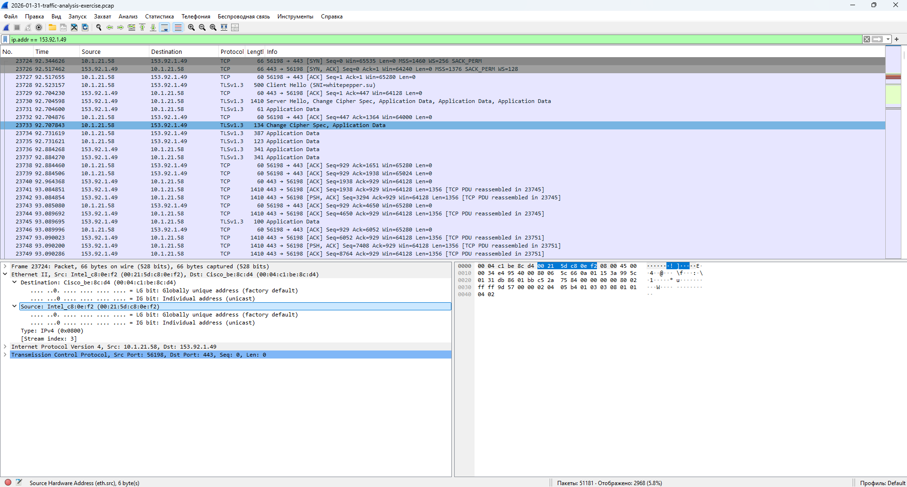
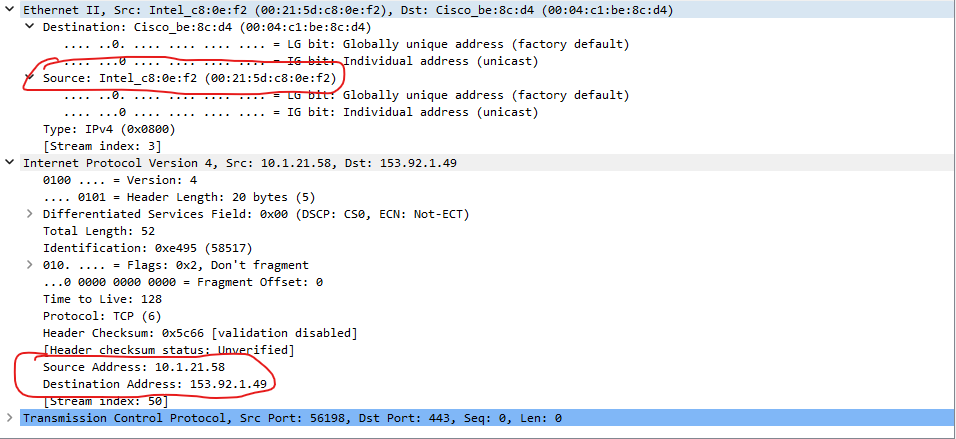
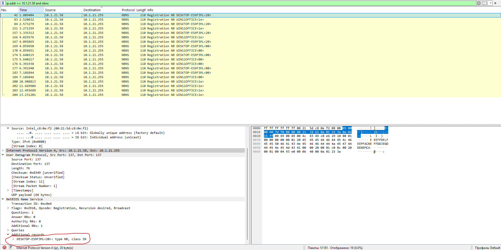
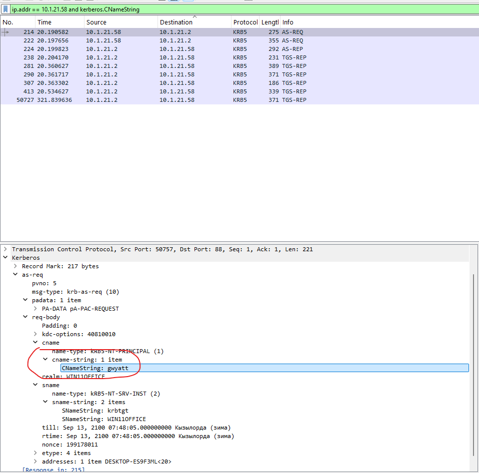
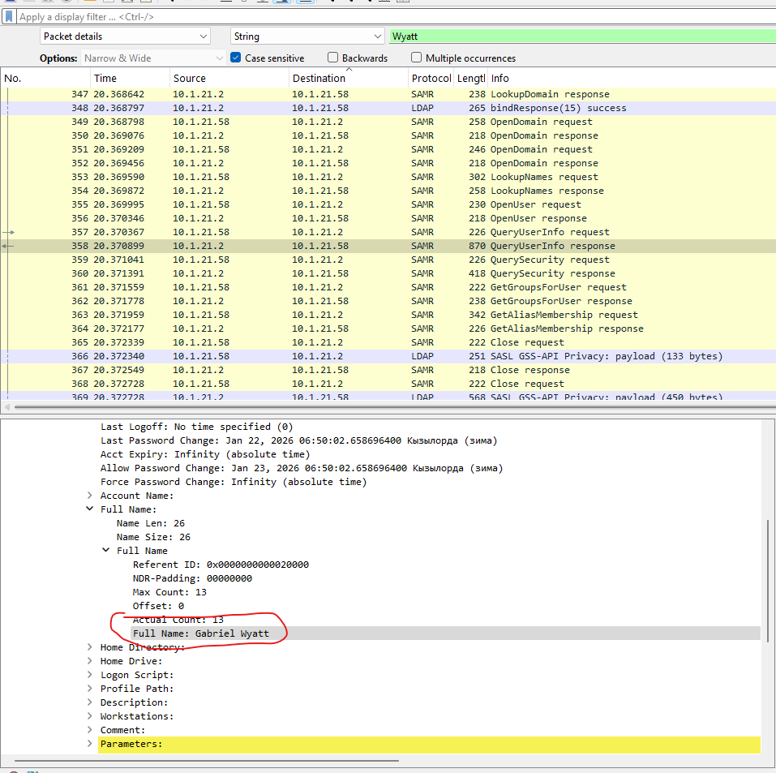
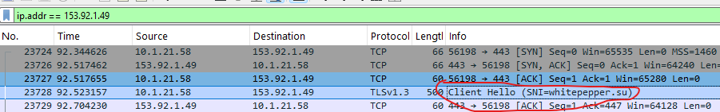
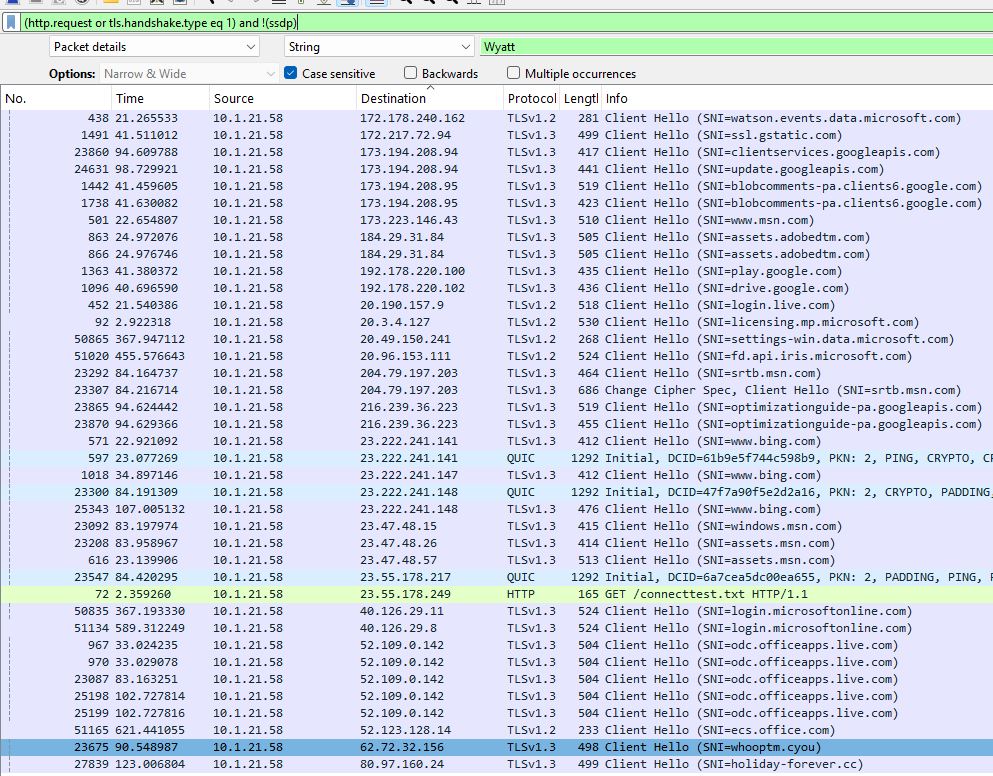
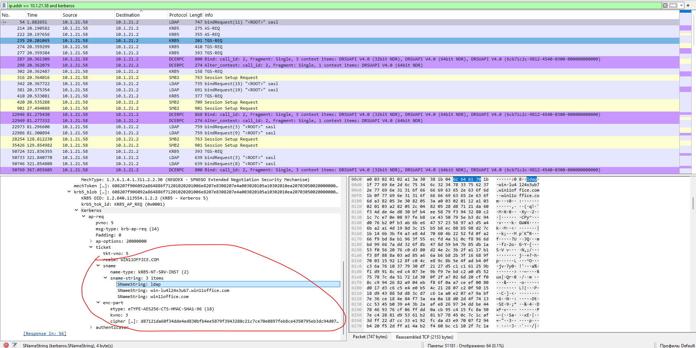

# Case 02 - Lumma Stealer Malware Traffic Analysis

## Overview

This case demonstrates a SOC-style investigation of malware-related network traffic associated with **Lumma Stealer**.

The analysis is based on a PCAP exercise from Malware-Traffic-Analysis.net:

```text
2026-01-31 - Traffic Analysis Exercise: Lumma in the Room-ah
```

The original alert was triggered by the following signature:

```text
ET MALWARE Lumma Stealer Victim Fingerprinting Activity
```

The alert involved traffic from the external IP address `153.92.1.49`. The goal of this investigation was to analyze the PCAP, identify the infected Windows client, determine the associated user, extract indicators of compromise, and document suspicious follow-up network activity.

---

## Investigation Goals

The main objectives of this case were to identify:

- infected Windows client IP address;
- MAC address of the infected client;
- hostname of the infected Windows system;
- Windows user account name;
- full name of the user;
- Lumma Stealer-related domain;
- additional suspicious domains observed after the initial malware traffic.

---

## Environment

| Item | Value |
|------|-------|
| LAN Segment | `10.1.21.0/24` |
| Domain | `win11office.com` |
| AD Environment | `WIN11OFFICE` |
| Domain Controller | `10.1.21.2 - WIN-LU4L24X3UB7` |
| Gateway | `10.1.21.1` |
| Broadcast Address | `10.1.21.255` |

---

## Key Findings

| Field | Value |
|-------|-------|
| Infected Windows Client IP | `10.1.21.58` |
| MAC Address | `00:21:5d:c8:0e:f2` |
| Hostname | `DESKTOP-ES9F3ML` |
| Windows User Account | `gwyatt` |
| Full Name | `Gabriel Wyatt` |
| External IP | `153.92.1.49` |
| Lumma Stealer Domain | `whitepepper.su` |
| Additional Suspicious Domains | `holiday-forever.cc`, `communicationfirewall-security.cc` |

---

## Tools Used

- Wireshark
- PCAP analysis
- DNS / TLS inspection
- NBNS analysis
- Kerberos analysis
- SAMR / DCERPC review
- IOC extraction

---

## Files

| File | Description |
|------|-------------|
| [report.md](report.md) | Full SOC-style incident report |
| [ioc.md](ioc.md) | Indicators of compromise, filters, and detection ideas |
| [screenshots/](screenshots/) | Evidence screenshots from Wireshark |

---

## Investigation Summary

The investigation started with the alert IP address:

```wireshark
ip.addr == 153.92.1.49
```

This filter revealed communication between the internal host `10.1.21.58` and the suspicious external IP `153.92.1.49`.

The infected host was then investigated using NBNS, Kerberos, SAMR/DCERPC, HTTP, and TLS traffic. The analysis identified the infected Windows client, associated user account, full user name, and suspicious domains involved in the malware-related communication.

---

## Wireshark Filters Used

### Alert IP Traffic

```wireshark
ip.addr == 153.92.1.49
```

### Hostname Identification

```wireshark
ip.addr == 10.1.21.58 and nbns
```

### User Account Identification

```wireshark
ip.addr == 10.1.21.58 and kerberos.CNameString
```

### Kerberos Traffic

```wireshark
ip.addr == 10.1.21.58 and kerberos
```

### LDAP / AD Traffic

```wireshark
ip.addr == 10.1.21.58 and ldap
```

### HTTP and TLS Overview

```wireshark
(http.request or tls.handshake.type eq 1) and !(ssdp)
```

### Suspicious Domain Search

```wireshark
frame contains "whitepepper"
frame contains "holiday-forever"
frame contains "communicationfirewall-security"
```

---

## Evidence Screenshots

### 1. Traffic to Alert IP

Traffic between the infected Windows client `10.1.21.58` and the suspicious external IP address `153.92.1.49`.



---

### 2. MAC Address Evidence

The Ethernet II header shows the source MAC address of the infected Windows client.



---

### 3. Hostname Evidence

NBNS traffic revealed the hostname of the infected Windows client: `DESKTOP-ES9F3ML`.



---

### 4. Kerberos User Account Evidence

Kerberos traffic revealed the Windows user account name through the `CNameString` field.



---

### 5. Full Name Evidence

SAMR/DCERPC traffic revealed the full name associated with the account `gwyatt`: `Gabriel Wyatt`.



---

### 6. Lumma Stealer Domain Evidence

TLS / HTTP-related traffic showed the Lumma Stealer-related domain `whitepepper.su`.



---

### 7. Suspicious Domains Overview

Additional suspicious domains were observed after the initial Lumma Stealer traffic.



---

### 8. Kerberos / LDAP Service Ticket Evidence

Kerberos and LDAP-related traffic confirmed interaction with the Active Directory domain controller.



---

## Indicators of Compromise

| Type | Value | Description |
|------|-------|-------------|
| Internal IP | `10.1.21.58` | Infected Windows client |
| MAC Address | `00:21:5d:c8:0e:f2` | MAC address of infected host |
| Hostname | `DESKTOP-ES9F3ML` | Hostname of infected client |
| User Account | `gwyatt` | Windows account associated with infected host |
| Full Name | `Gabriel Wyatt` | Full name associated with account |
| External IP | `153.92.1.49` | Suspicious IP related to Lumma Stealer traffic |
| Domain | `whitepepper.su` | Lumma Stealer-related domain |
| Domain | `holiday-forever.cc` | Suspicious follow-up HTTPS traffic |
| Domain | `communicationfirewall-security.cc` | Suspicious follow-up HTTPS traffic |

---

## Risk Analysis

The host `10.1.21.58` communicated with infrastructure associated with Lumma Stealer activity. Lumma Stealer is an information-stealing malware family, so this activity should be treated as high risk.

Potential risks include:

- credential theft;
- browser data theft;
- session token theft;
- sensitive data exfiltration;
- additional malware activity;
- follow-up communication with attacker-controlled infrastructure.

The additional suspicious `.cc` domains observed after the Lumma-related traffic increase the likelihood of continued malicious activity or follow-up malware communication.

---

## Severity Assessment

| Category | Assessment |
|----------|------------|
| Severity | High |
| Confidence | High |
| Impacted Host | `10.1.21.58` |
| Impacted User | `Gabriel Wyatt / gwyatt` |
| Main Concern | Lumma Stealer-related malware communication |
| Required Action | Immediate containment and endpoint investigation |

---

## Recommended SOC Actions

- Isolate the infected host `10.1.21.58` from the network.
- Preserve the host for forensic investigation.
- Reset the password for the user account `gwyatt`.
- Review endpoint logs for suspicious process execution.
- Search SIEM logs for `whitepepper.su`.
- Search DNS, proxy, and firewall logs for `153.92.1.49`.
- Search for `holiday-forever.cc` and `communicationfirewall-security.cc`.
- Check if other internal hosts contacted the same indicators.
- Block confirmed malicious domains and IP addresses.
- Review browser artifacts and saved credentials.
- Reimage the host if compromise is confirmed.

---

## Conclusion

The PCAP analysis identified `10.1.21.58` as the infected Windows client. The host used the MAC address `00:21:5d:c8:0e:f2` and hostname `DESKTOP-ES9F3ML`.

Kerberos traffic revealed the Windows user account `gwyatt`, and SAMR/DCERPC traffic revealed the full name `Gabriel Wyatt`.

The suspicious traffic to `153.92.1.49` was associated with the Lumma Stealer-related domain `whitepepper.su`. Additional suspicious HTTPS traffic was also observed to `holiday-forever.cc` and `communicationfirewall-security.cc`.

This case demonstrates practical SOC Analyst skills in malware traffic analysis, host identification, user attribution, IOC extraction, Wireshark filtering, and incident reporting.
