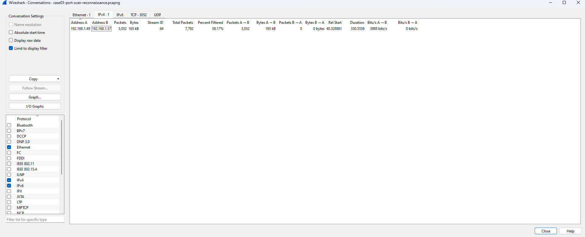
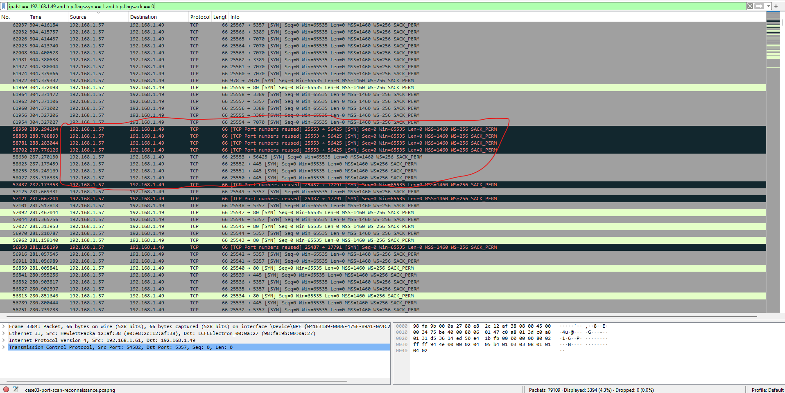
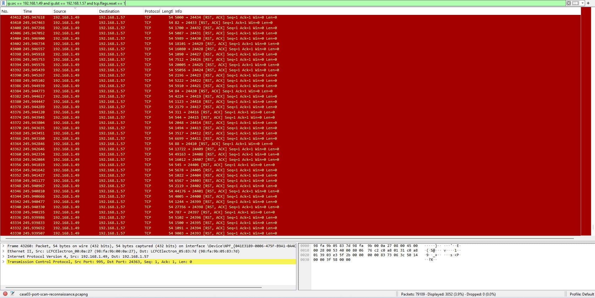
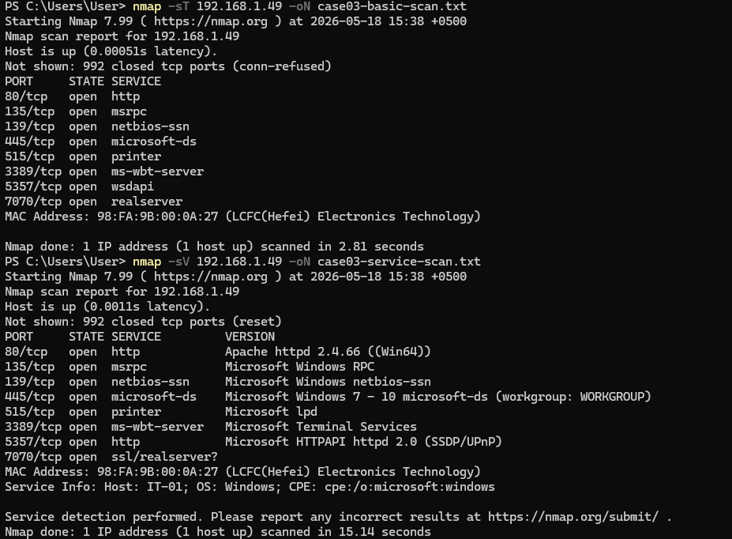
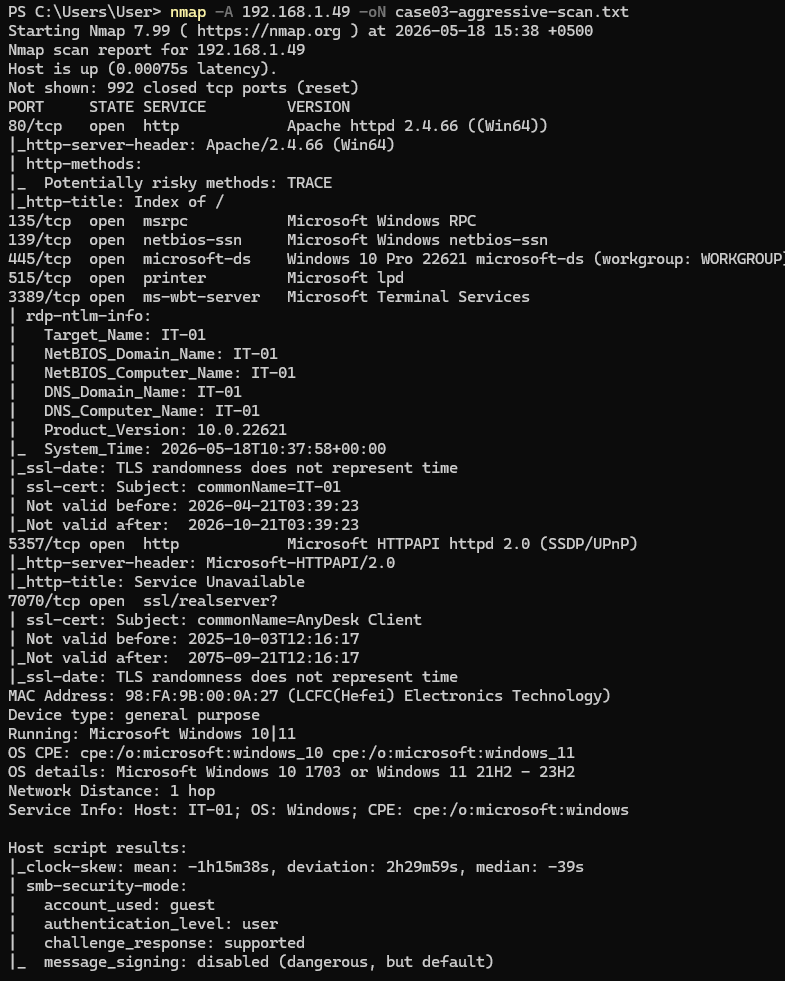
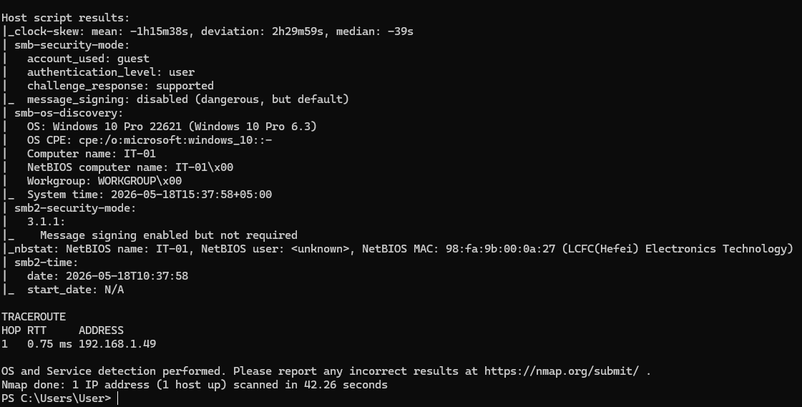

# Case 03 - Port Scan Reconnaissance Analysis

## Overview

This case demonstrates a SOC-style investigation of network reconnaissance and port scanning activity.

A Windows-based scanner host performed Nmap scans against a Windows target host while Wireshark captured the traffic on the target machine.

## Lab Scenario

| Role | IP Address | Description |
|------|------------|-------------|
| Scanner / Attacker | `192.168.1.57` | Windows host running Nmap |
| Target / Victim | `192.168.1.49` | Windows host monitored with Wireshark |

## Key Findings

| Field | Value |
|-------|-------|
| Scanner IP | `192.168.1.57` |
| Target IP | `192.168.1.49` |
| Target MAC Address | `98:FA:9B:00:0A:27` |
| Target Hostname | `IT-01` |
| Target OS | Windows 10 / Windows 11 |
| Scan Type | TCP connect scan, service detection, aggressive scan |

## Open Ports Identified

| Port | Service | Details |
|------|---------|---------|
| `80/tcp` | HTTP | Apache httpd 2.4.66 on Windows |
| `135/tcp` | MSRPC | Microsoft Windows RPC |
| `139/tcp` | NetBIOS-SSN | Microsoft Windows NetBIOS session service |
| `445/tcp` | SMB | Microsoft SMB / microsoft-ds |
| `515/tcp` | Printer | Microsoft LPD |
| `3389/tcp` | RDP | Microsoft Terminal Services |
| `5357/tcp` | HTTPAPI | Microsoft HTTPAPI 2.0 |
| `7070/tcp` | SSL / Remote Access | AnyDesk Client certificate observed |

## Tools Used

- Nmap for Windows
- Wireshark
- Windows Command Prompt
- PCAP analysis
- TCP flag analysis

## Files

| File | Description |
|------|-------------|
| [report.md](report.md) | Full SOC-style analysis report |
| [ioc.md](ioc.md) | Scan indicators, exposed services, and detection ideas |
| [screenshots/](screenshots/) | Evidence screenshots from Nmap and Wireshark |

## Detection Logic

The scanner IP was identified by filtering incoming TCP SYN packets to the target host.

```wireshark
ip.dst == 192.168.1.49 and tcp.flags.syn == 1 and tcp.flags.ack == 0
```

This showed repeated connection attempts from `192.168.1.57` to `192.168.1.49` across multiple destination ports. This behavior is consistent with port scanning and reconnaissance activity.

## Wireshark Filters Used

### Incoming SYN Packets to Target

```wireshark
ip.dst == 192.168.1.49 and tcp.flags.syn == 1 and tcp.flags.ack == 0
```

### Open Port Evidence - SYN/ACK Responses

```wireshark
ip.src == 192.168.1.49 and ip.dst == 192.168.1.57 and tcp.flags.syn == 1 and tcp.flags.ack == 1
```

### Closed Port Evidence - Reset Responses

```wireshark
ip.src == 192.168.1.49 and ip.dst == 192.168.1.57 and tcp.flags.reset == 1
```

## Evidence Screenshots

### Conversations Overview



### SYN Packets from Scanner


### Open Ports - SYN/ACK Responses



### Reset Responses



### Nmap Basic and Service Scan



### Nmap Aggressive Scan - Part 1



### Nmap Aggressive Scan - Part 2



## Security Observations

- RDP was exposed on port `3389/tcp`.
- SMB was exposed on port `445/tcp`.
- Apache HTTP server was exposed on port `80/tcp`.
- Apache reported the `TRACE` method as potentially risky.
- AnyDesk-related SSL certificate was observed on port `7070/tcp`.
- SMB message signing was enabled but not required.

## Conclusion

The analysis identified `192.168.1.57` as the scanner host and `192.168.1.49` as the target.

Wireshark evidence showed repeated TCP SYN packets from the scanner to the target, SYN/ACK responses from open ports, and RST responses for closed or rejected connections.

This case demonstrates practical SOC Analyst skills in port scan detection, network traffic analysis, Nmap result interpretation, and defensive reporting.
